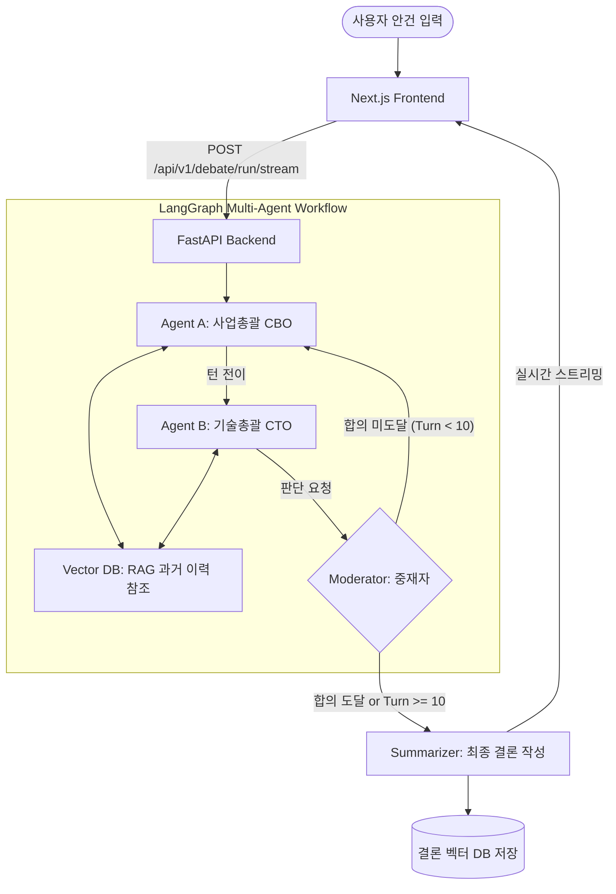

# AI-Council V2 : 멀티 에이전트 기반 자율 토론 및 의사결정 플랫폼


AI-Council V2는 기업 내 중요한 의사결정 안건에 대해 상반된 관점을 가진 여러 AI 전문가(에이전트)들이 실시간으로 토론을 진행하고, 중재자가 상호 합의 여부를 판단하여 최종 의사결정 보고서를 도출하는 고도화된 풀스택 AI 플랫폼입니다.

---

## 🌟 서비스 개요 (Overview)

기업의 주요 안건(예: 신규 사업 확장, 기술 아키텍처 개편 등)에 대해 단일 LLM의 편향된 답변에 의존하지 않고, **사업총괄(Proposer/CBO)**과 **기술총괄(Critic/CTO)** 등 서로 다른 페르소나를 부여받은 에이전트들이 논리적 공방(티키타카)을 펼칩니다. 
과거의 유사 의사결정 이력을 RAG(Retrieval-Augmented Generation)로 실시간 참조하며, **중재자(Moderator)**가 합의를 도출하고 최종 요약 보고서를 생성합니다.

---

## 🏛 시스템 아키텍처 및 워크플로우



---

## ✨ 주요 핵심 기능 (Key Features)

### 1. LangGraph 기반 자율 토론 (Tiki-Taka Debate)
* **Agent A (Proposer)**: 제안된 안건의 수익성, 시장 기회, 고객 가치를 중심으로 공격적인 전략을 제시합니다.
* **Agent B (Critic)**: 기술적 실현 가능성, 아키텍처 한계, 보안 리스크, 유지보수 비용을 냉철하게 비판하고 현실적인 대안을 제시합니다.
* **커스텀 페르소나 및 지침**: 프론트엔드 UI를 통해 각 에이전트의 역할 이름과 세부 프롬프트 지침을 자유롭게 커스텀할 수 있습니다.

### 2. 의장(Moderator)의 자율 합의 판별 및 요약
* 토론이 2턴 이상 진행되면 중재자 에이전트가 대화 맥락을 파악하여 상호 합의 도달 여부(`[CONSENT_REACHED: YES/NO]`)를 자율적으로 판단합니다.
* 합의에 도달하거나 최대 10턴에 도달하면 최종 요약 에이전트가 의사결정 결과 보고서와 향후 실행 계획을 도출합니다.

### 3. 과거 의사결정 이력 참조 (RAG)
* 벡터 데이터베이스를 연동하여 사용자의 토론 주제와 유사한 과거의 결정 이력 및 성공/실패 사례를 실시간으로 검색하고 프롬프트 컨텍스트에 주입합니다.

### 4. 실시간 비동기 스트리밍 & 제어
* **청크 단위 스트리밍**: LangGraph의 `astream_events`를 활용하여 에이전트가 생각하고 발화하는 과정을 실시간으로 UI에 렌더링합니다.
* **즉시 중단 및 초기화 (Abort Controller)**: 토론 진행 중 언제든지 전송을 중단하거나 대화 상태 및 입력값을 깨끗하게 초기화할 수 있는 리셋 기능을 제공합니다.

### 5. 유연한 최신 LLM 지원
* Google Gemini (Gemini 3.1 Flash Lite, Gemini 2.5 Flash), Gemma 4 등 최신 고성능 모델을 에이전트별로 선택할 수 있습니다.

---

## 📂 프로젝트 디렉토리 구조

```text
AI-Council/
├── backend/                  # FastAPI 백엔드
│   ├── app/
│   │   ├── core/             # 환경 설정 및 설정 관리
│   │   ├── services/         # LangGraph 토론, RAG 벡터 서비스
│   │   └── main.py           # FastAPI 진입점 및 라우터
│   └── requirements.txt      # 파이썬 의존성 패키지
├── frontend/                 # Next.js 프론트엔드
│   ├── src/app/
│   │   ├── page.tsx          # 메인 토론 보드 UI (React 19)
│   │   └── globals.css       # TailwindCSS 및 커스텀 스타일
│   └── package.json          # 노드 의존성 패키지
├── docker-compose.yml        # 풀스택 도커 컨테이너 배포 설정
├── run_native.sh             # 로컬 직접 실행 쉘 스크립트
└── README.md                 # 프로젝트 문서
```

---

## 🚀 설치 및 실행 가이드 (Getting Started)

### 사전 필수 요건
* 루트 디렉토리의 `.env` 파일에 유효한 `GOOGLE_API_KEY`가 설정되어 있어야 합니다.
  ```env
  GOOGLE_API_KEY="your-google-api-key-here"
  OLLAMA_BASE_URL="http://host.docker.internal:11434"
  ```

### 방법 A. Docker Compose로 원클릭 실행 (추천)
모든 백엔드 및 프론트엔드 환경을 격리된 컨테이너로 손쉽게 실행합니다.
```bash
docker compose up --build -d
```
* **백엔드 API**: [http://localhost:8000](http://localhost:8000)
* **프론트엔드 UI**: [http://localhost:3000](http://localhost:3000)

### 방법 B. 로컬 스크립트로 직접 실행 (`run_native.sh`)
로컬 환경에 Python 및 Node.js가 설치되어 있는 경우 스크립트를 통해 동시에 실행할 수 있습니다.
```bash
chmod +x run_native.sh
./run_native.sh
```

---

## ✨ 아키텍처 및 UI 특장점
* **프리미엄 디자인**: 다크 블루 톤의 슬릭한 배경과 Glassmorphism 효과, 실시간 타이핑 인디케이터가 결합된 최신의 사용자 경험을 선사합니다.
* **견고한 예외 처리**: LLM API 호출 지연 시 60초 타임아웃 방어 및 폴백(Fallback) 메커니즘을 지원하여 스트리밍 서버의 무중단 동작을 보장합니다.
